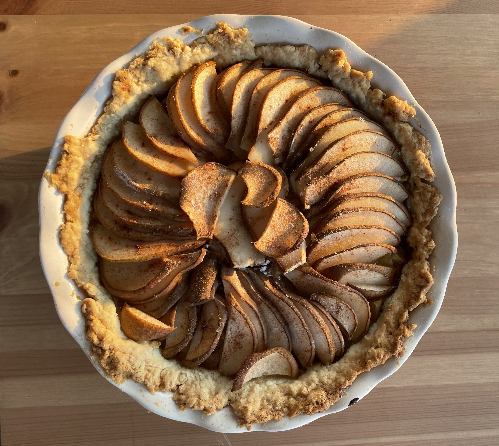
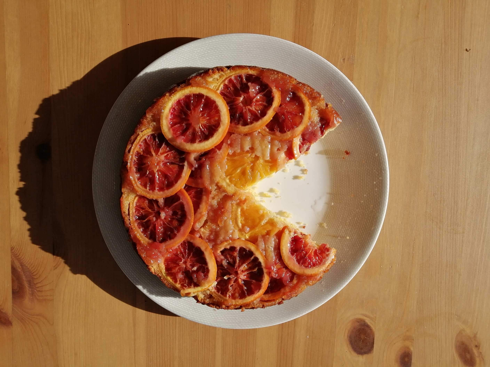
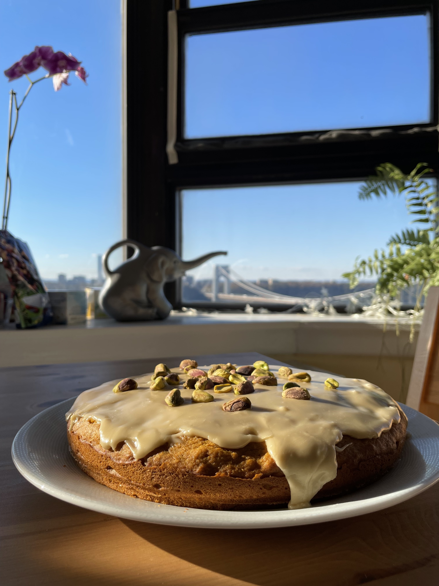
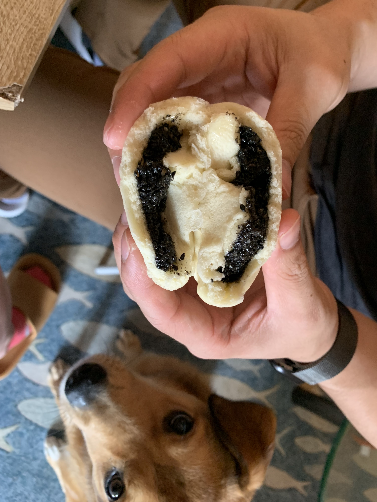
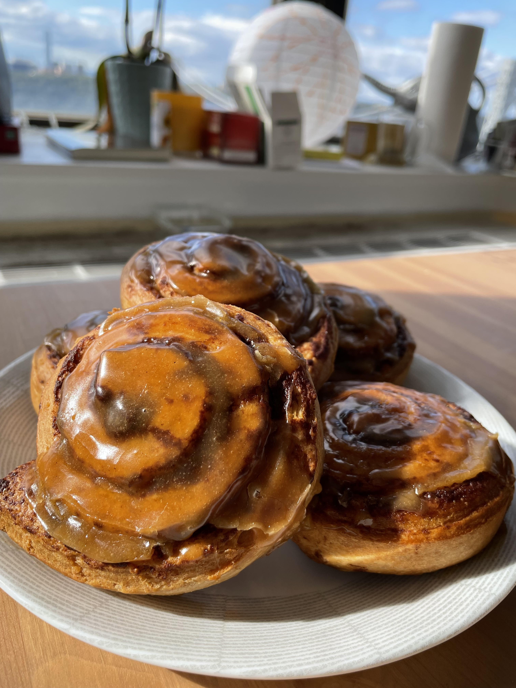

 

### Hello! :) `r emo::ji("cowboy")`

Hi! I'm Sophie Zhang (they/them) and I'm currently a second-year MPH student in Epidemiology with a certificate in Biostatistics at the Columbia Mailman School of Public Health.

I'm originally from Massachusetts and went to undergrad in the Bay Area, and now I'm back in the Northeast for the forseeable future. I'm also an avid baker, cat lover, and fall-weather enthusiast; and I am excited to give back to the communities I'm a part of through public health research!

Below are pictures of some of the bakes I've attempted in the past year:

 

 

Here's a direct link if you'd like to learn more about [my background and experience](experience.html). You can also navigate to this page using the `Experience` tab at the top.

I've also created a [a flexdashboard](flexdashboard.html) that you can use to interactively explore data from `Instacart`. You can navigate to this page using the `flexdashboard` tab at the top.

 

### About this site

I created this website for [P8105: Data Science I](https://p8105.com/), a class that I'm currently taking. This specific site was created for Homework 4, and hopefully I'll make an updated personal website in the future!

 

### Contact Information

Sophie Zhang (they/them)  
MPH Candidate in Epidemiology  
Certificate in Biostatistics & Applied Data Science  
[Columbia Mailman School of Public Health](https://www.publichealth.columbia.edu/)  
Email: sjz2120@cumc.columbia.edu  